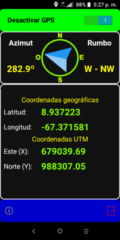
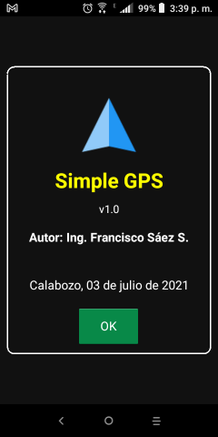

# Simple GPS

---

## Descripción

Sencilla app móvil para Android que muestra las coordenadas del GPS, tanto en formato geográfico como UTM (Universal Transversal Mercator). Guarda además dichas coordenadas si así se requiere.

---

## Lenguaje/framework

* Lenguaje: Delphi 11.2 Tokyo, empleando sólo componentes nativos. 
* Framework: Firemonkey. 

---

## Autor

Ing. Francisco José Sáez Soto.

e-mail: **fjsaez@gmail.com**

LinkedIn: **linkedin.com/in/francisco-josé-sáez-soto**

GitHub: **github.com/fjsaez**

---

Calabozo (Venezuela), noviembre de 2020.

---

## Imágenes de la aplicación

### Icono

### Pantalla principal

### Acerca...

